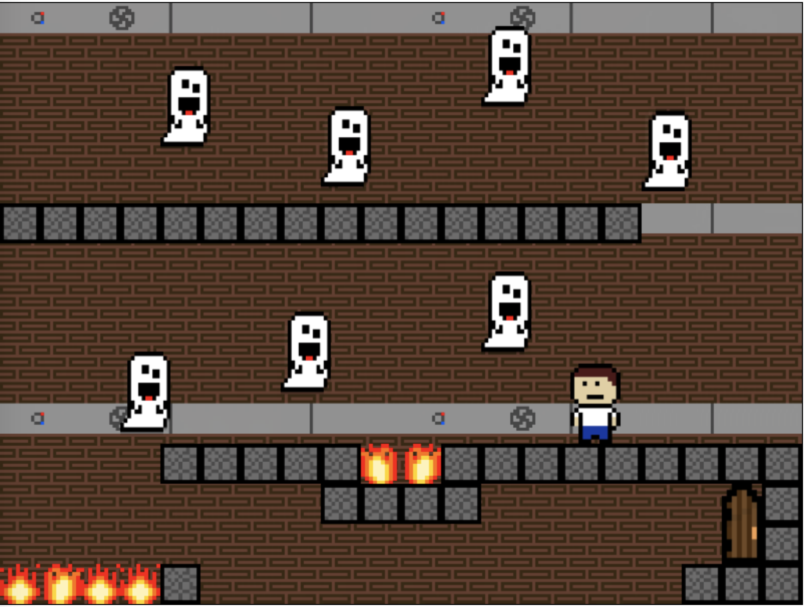
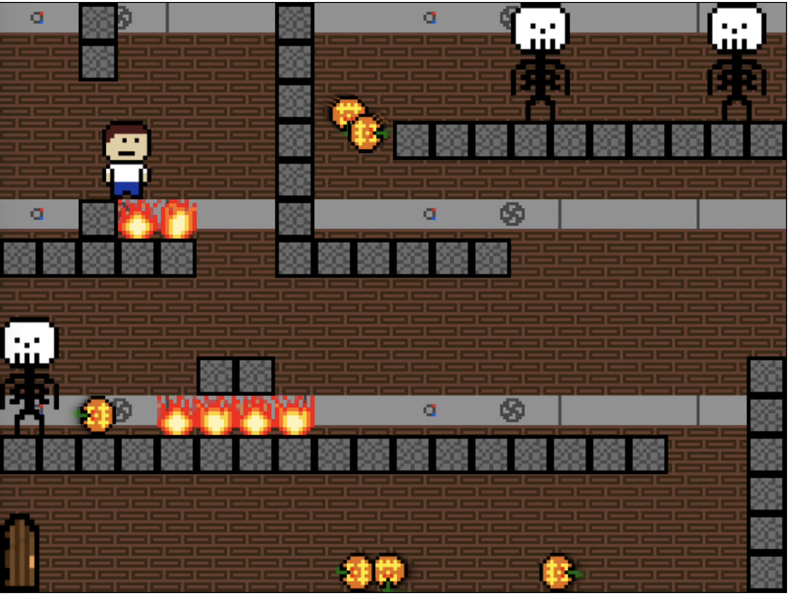
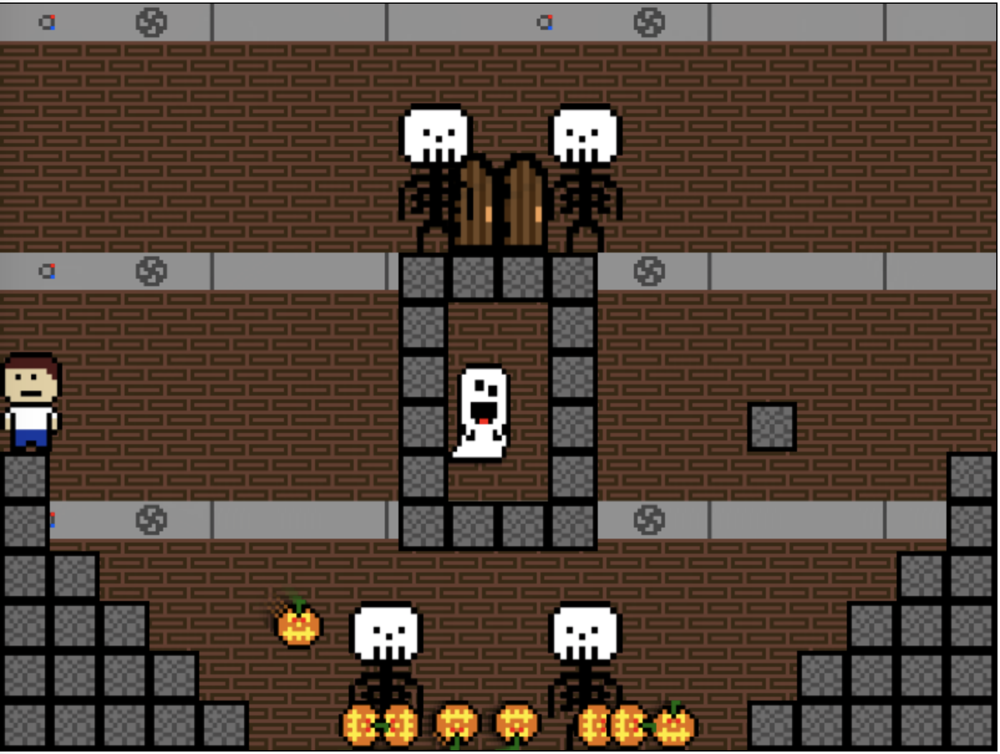
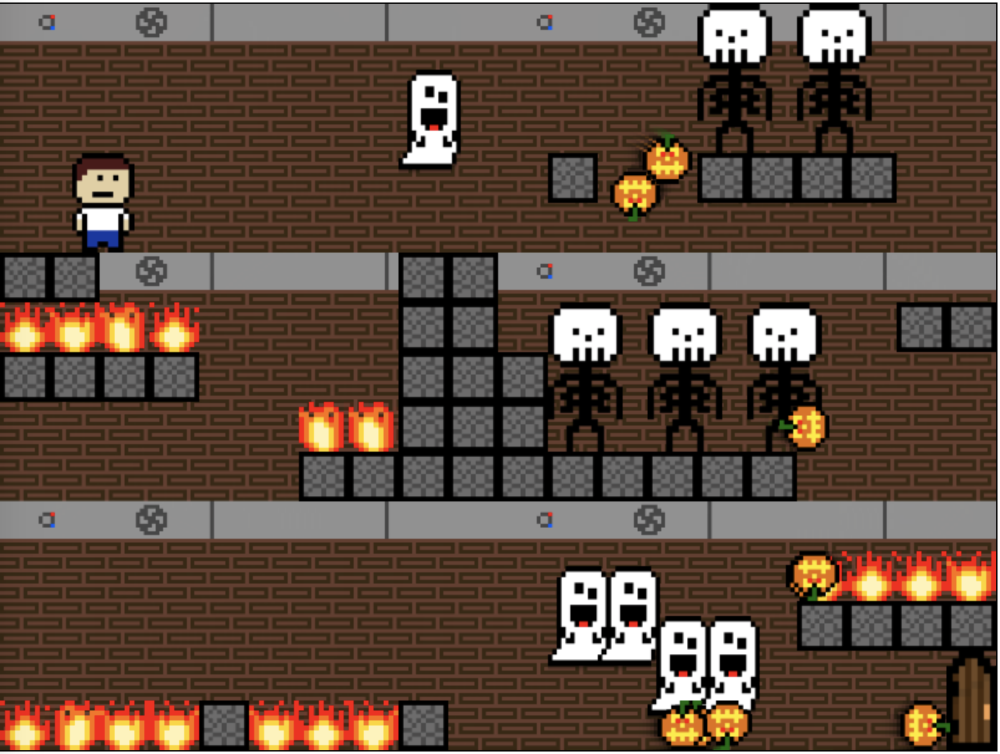

# 🔥💀 Haunted House 👻🔥
## 🎃 This was the first original video game I made, all in pure javascript. 🎃
It was made in 36 hours for the spooky 2D game jam. 
All of the art, code, music, was original by me, so it wasn't too bad for a first try. 

<table>
	<tr>
		<td>
			
		</td>
		<td>
			
		</td>
	</tr>
	<tr>
		<td>
			
		</td>
		<td>
			
		</td>
	</tr>
</table>

<a href="https://insomnizac.itch.io/escape-the-haunted-house"><button>Play the game here!</button></a>